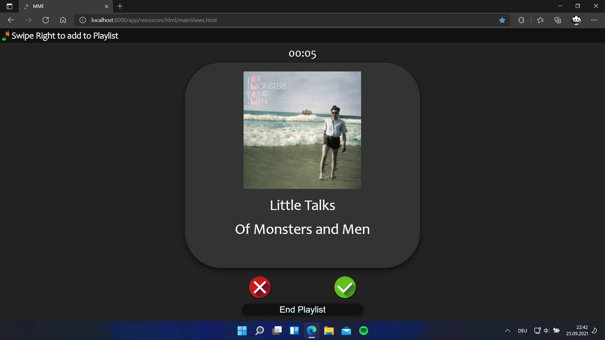

## App - Songs Tindern ##

### Hintergrund ###

Musik hören ist mittlerweile alltäglich, ob im Radio oder auf einem der zahlreichen Streaminganbieter. Meist ist es dabei aber so, dass man vor allem Songs hört, die man schon kennt, deshalb ist es schwierig neue Musik zu entdecken. Auf dieses Problem will sich unsere Anwendung fokussieren, Nutzerinnen und Nutzern soll es möglich sein unvoreingenommen, also ohne sich auf ein bestimmtes Genre oder einen bestimmten Künstler zu beschränken, neue Musik zu finden. Bei Songs-Tindern werden zufällig ausgewählte Songs abgespielt und, falls ein Song gefällt, kann dieser gespeichert werden. Nach einer Runde können gespeicherte Songs in Playlists eingefügt werden. Da Spotify der am weitesten verbreitete Musik-Streaminganbieter ist, haben wir uns für unsere Applikation für die Nutzung der Dienste dieses Anbieters entschieden.

### Ziele ###

Dem Nutzer ist es mit unserer App möglich, Songs aller Art zu entdecken. Wenn ein Song gefällt, dann soll es so einfach wie möglich sein diesen wieder zu finden, damit man ihn später wieder anhören kann. Dafür kann der Nutzer in unserer Anwendung Playlists auf seinem Spotify-Account erstellen, die dann mit den gelikten Songs befüllt wird. Diese Playlists lassen sich dann sowohl in unserer Anwendung als auch auf Spotify abspielen. Zudem ist es möglich einen Überblick über die bereits gelikten Songs anzuzeigen, sowie Statistiken über die Art der gewsipten Songs zu bekommen. Mit letzterem Feature wollen wir dem Nutzer mehr über sein Like-Verhalten verraten, und ihm deutlich machen, welche Art von Songs ihm gefallen, um seine Suche nach neuer Musik künftig einfacher zu gestalten. Um den Spielcharakter unserer Applikation zu erhöhen (Stichwort: Gamification / Joy of Use), bieten wir dem Nutzer verschieden Modi an, neue Musik zu entdecken. So muss man sich im "Hard Mode" schnell entscheiden, ob ein Song gefällt und im "Hidden Mode" werden Titel, Interpret und Cover versteckt, damit Vorurteile des Nutzenden negiert werden.

### Funktionen ###

#### 1. Anmeldung bei Spotify ####

Bei erstmaliger Ausführung unserer Anwendung muss sich der Nutzer mit seinem **Spotify Premium** Acccount anmelden. Das Anmelden ist nur einmalig erforderlich, bei erneutem Ausführen wird automatisch zur Startseite weiter geleitet.

https://user-images.githubusercontent.com/69906431/135102731-1e8fd513-8a4a-4058-a191-a4663cdc9479.mp4

#### 2. Swipen #####

Nach links Swipen bedeutet dislike und nach rechts like. Das Swipen geht sowohl per Touch als auch mit der Maus. Alternativ können auch die Pfeiltasten oder die angezeigten Buttons verwendet werden.

https://user-images.githubusercontent.com/69906431/135102811-eabb7485-828a-4223-b1a9-a5a6f1048fb7.mp4

#### 3. Playlist-Selection ####

Wenn mindestens ein Song gelikt wurde, wird zum Playlist-Selection Screen weitergeleitet. Hier können Song zu neu erstellten Playlists hinzugeüfgt werden, als auch zu den bereits (mit der Anwendung) erstellten Playlists hinzugefügt werden. Es gibt außerdem eine Übersicht über die gelikten Songs, die der Playlist hinzugefügt werden. In dieser Ansicht kann man sich die einzelnen Songs auch nochmal anhören.

https://user-images.githubusercontent.com/69906431/134492191-74e1830d-9790-4e53-9db2-95804ab8dc14.mp4

#### 4. Game Modes ####

Für das Verwenden unserer Anwendung gibt es verschiedene Spielmodi:
- **Normal Mode**: Es gibt keine Zeitbeschränkung, man kann drei mal zu einer zufälligen Stelle im Song springen (Doppelklick auf Songkarte) und es werden alle Details zu einem Song angezeigt)
- **Hidden Mode**: Alle Song Details (Cover, Titel und Interpret) werden verborgen und der Nutzer kann sich nur auf den Song konzentrieren, es herrscht eine Zeitbeschränkung von 25 sekunden (danach wird der Song automatisch gedislikt).
- **Random Mode**: Meist so wie der Normal Mode, allerdings kommt nach einer zufälligen Anzahl an Songs (zwischen zwei und sieben) eine Zeitbeschränkung von acht Sekunden, die aber dann nur für den einen Song gilt. Außerdem startet der Song automatisch an einer zufälligen Stelle.
- **Hard Mode**: Song startet an einer zufälligen Stelle und es herrscht immer eine Zeitbeschränkung von sieben Sekunden. Danach wird der Song automatisch gedislikt. Außerdem kann der Nutzer hier nicht mehr an eine zufällige Stelle im Song springen (siehe 6.).

https://user-images.githubusercontent.com/69906431/134492238-715aa717-9b47-40ae-96c6-ac3193b62876.mp4

#### 5. History #####

Der Nutzer kann sich alle bereits gelikten Songs in einer History anzeigen lassen. Hier können einzelne Songs auch noch einmal abgespielt, aus der Ansicht gelöscht oder zu einer anderen Playlist hinzugefügt werden.

https://user-images.githubusercontent.com/69906431/134492269-f58af07f-5f26-48ff-be1f-eab11e1b2c3b.mp4

##### 5.1 History Sortierung #####

Die History kann nach verschiedenen Kriterien sortiert werden. Bei der Sortierung nach Playlists, können zudem auch ganze PLaylist abgespielt werden

https://user-images.githubusercontent.com/69906431/134492300-b4e49045-4e8a-4753-9893-4d790bee4dc7.mp4

#### 6. Springen ####

In allen GameModes (außer dem Hard Mode) kann der Nutzer 3 mal pro Song an eine zufällige Stelle springen. Dies ist hilfreich, wenn man eine andere Stelle von dem Song hören will, falls dieser z.B. ein langes Intro hat.

https://user-images.githubusercontent.com/69906431/135104435-aae010ad-cf5c-4374-8b88-270db517ca90.mp4

#### 7. Statistiken ####

Es können Statistiken über das Like-Verhalten eines Nutzers angezeigt werden. Dem Nutzer werden neben seinem Lieblingsgenre auch die Anzahl gehörter Songs, wie auch die durchschnittliche "Tanzbarkeit" zu den gelikten Songs angezeigt. Außerdem werden in drei passenden Diagrammen das Like-Verhalten, die Neigung der gelikten Songs zu Akustik oder Elektronisch und die Neigung zu Vokal (stimmlastig) oder Instrumental (stimmlos) angezeigt. Somit kann der Nutzer mehr über seinen Musikgeschmack. 

https://user-images.githubusercontent.com/69906431/134492409-71ae34ef-1463-4e0d-bda4-6fb3a50f0bb8.mp4
